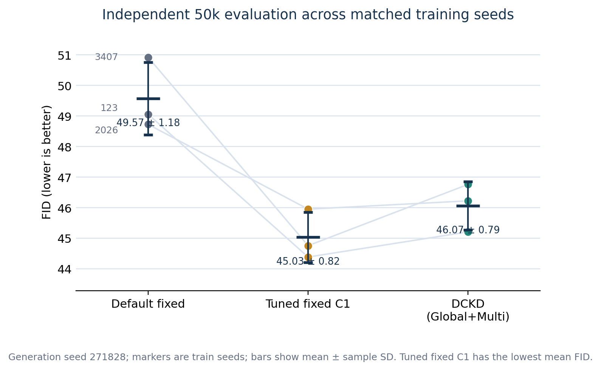
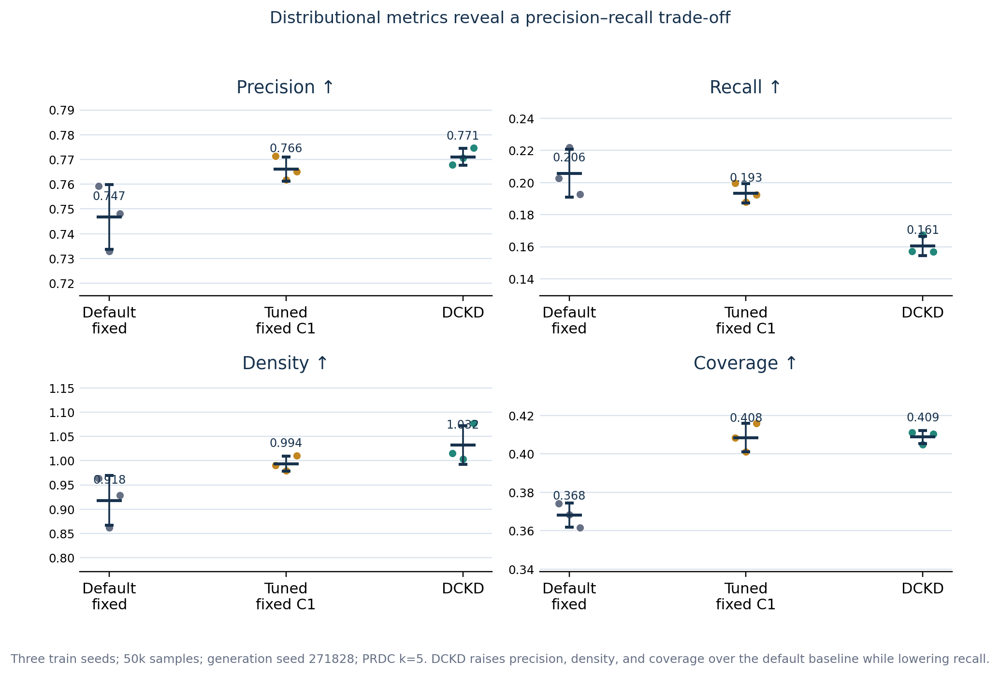

# Density-Calibrated Kernel Drifting (DCKD)

<p align="center">
  <a href="http://arxiv.org/abs/2602.04770"></a>
  <a href="https://github.com/Nopon-Knowledge/drifting-jax/actions/workflows/ci.yml"></a>
  <a href="https://github.com/lambertae/drifting"></a>
  <a href="https://huggingface.co/Goodeat/drifting"></a>
</p>

Research code for **Density-Calibrated Kernel Drifting (DCKD)**, an extension
of [Generative Modeling via Drifting](https://github.com/lambertae/drifting).
DCKD calibrates the feature-space kernel radius from the current
`k`-nearest-neighbour geometry during training. It does not add generator
parameters or alter the one-network-evaluation inference path.

This repository is based on upstream commit
[`accd0cf`](https://github.com/lambertae/drifting/commit/accd0cf09c33b70892d33941d2a287ca86cb92e1).
The DCKD study was run on ImageNet-256 with one NVIDIA A800, 30k training
steps, three training seeds, and one frozen independent 50k-sample evaluation
stream. The frozen protocol, per-seed aggregate results, tests, and A800
configurations are included.

> **Result boundary.** DCKD-Global-MS improves the released fixed-kernel
> baseline on FID for all three observed seeds, but a separately selected
> tuned fixed-kernel control achieves lower FID on all three seeds. DCKD also
> trades lower Recall for higher IS, Precision, Density, and Coverage. This
> release therefore supports kernel-scale calibration as an important design
> factor; it does not claim that density adaptation is universally superior
> to a well-tuned fixed bandwidth.

## DCKD Results

All values below use 50,000 generated samples and training seeds 123, 2026,
and 3407. Values are descriptive mean +/- sample standard deviation.

| Method | FID (lower) | IS (higher) | Precision | Recall | Density | Coverage |
| --- | ---: | ---: | ---: | ---: | ---: | ---: |
| Released fixed kernel | 49.570 +/- 1.185 | 41.620 +/- 1.452 | 0.7468 | **0.2058** | 0.9179 | 0.3681 |
| DCKD-Global-MS | 46.065 +/- 0.789 | **52.505 +/- 0.908** | **0.7710** | 0.1605 | **1.0321** | **0.4088** |
| Tuned fixed C1 | **45.032 +/- 0.819** | 51.346 +/- 1.447 | 0.7660 | 0.1933 | 0.9936 | 0.4085 |

<p align="center">
  
  
</p>

The standardized A800 rerun measured 5.563 GPU-hours for the released fixed
kernel and 7.851 GPU-hours for DCKD-Global-MS (+41.12%). Both use 132.7M
parameters, one NFE, 49.30 GFLOPs per sample, and approximately 3.41 GiB peak
inference memory; measured inference latency and throughput remain effectively
unchanged. See [`results/`](results/) for the aggregate tables and
[`protocols/pr_dckd_v1.yaml`](protocols/pr_dckd_v1.yaml) for the frozen design.

## DCKD Quick Start

After completing the environment and ImageNet latent-cache setup below, run
the released fixed baseline and DCKD-Global-MS with matched seeds:

```bash
JAX_PLATFORMS=gpu,cpu python main.py --gen \
  --config configs/gen/latent_ablation_a800_hpc.yaml \
  --workdir runs/baseline_seed123 \
  --config.train.seed 123

JAX_PLATFORMS=gpu,cpu python main.py --gen \
  --config configs/gen/latent_ablation_a800_v4_3_dckd_global_radius.yaml \
  --workdir runs/dckd_global_ms_seed123 \
  --config.train.seed 123
```

Evaluate a completed work directory with the same 50k generation stream:

```bash
JAX_PLATFORMS=gpu,cpu python inference.py \
  --init-from runs/dckd_global_ms_seed123 \
  --cfg-scale 2.5 \
  --seed 271828 \
  --num-samples 50000 \
  --eval-batch-size 128 \
  --json-out results_dckd_seed123.json
```

Set `IMAGENET_PATH`, `IMAGENET_CACHE_PATH`, `IMAGENET_FID_NPZ`,
`IMAGENET_PRDC_NPZ`, and `HF_ROOT` through environment variables or
`utils/env.py`. ImageNet, latent caches, pretrained weights, generated samples,
and FID/PRDC feature archives are intentionally not redistributed.

## Repository Contents

- `drift_loss.py`: fixed and density-calibrated drifting objectives.
- `configs/gen/*dckd*.yaml`: local/global and single/multi-scale variants.
- `inference.py`: manifest-backed FID, IS, and PRDC evaluation.
- `protocols/pr_dckd_v1.yaml`: frozen experimental design.
- `results/`: aggregate, non-image-dataset experimental tables and plots.
- `tests/`: fixed-path equivalence, adaptive-kernel, evaluator, and manifest tests.
- `scripts/`: A800 launch, reference preparation, evaluation, and efficiency tools.

The remaining sections retain the upstream installation, pretrained-model,
training, and inference documentation.

<p align="center">
  
</p>

The underlying JAX codebase implements the ImageNet experiments of
*Generative Modeling via Drifting*. Upstream provides training, inference, and
pretrained weights for one-step image generation on ImageNet 256x256.

## Generated Samples

Uncurated conditional ImageNet 256×256 samples (1 NFE, CFG scale 1.0, FID 1.54):

<p align="center">
  
  
  
  
</p>
<p align="center">
  
  
  
  
</p>
<p align="center">
  
  
  
  
</p>

## Training Dynamics

The generated distribution **q** evolves toward the data distribution **p** during training.
Try the interactive toy demo to see the algorithm in action:

[](https://colab.research.google.com/github/lambertae/lambertae.github.io/blob/main/projects/drifting/notebooks/drifting_model_demo.ipynb)

<table align="center">
  <tr>
    <th align="center">Middle Init</th>
    <th align="center">Far-Away Init</th>
    <th align="center">Collapsed Init</th>
  </tr>
  <tr>
    <td align="center"></td>
    <td align="center"></td>
    <td align="center"></td>
  </tr>
</table>

---

## Table of Contents

- [Quick Start (Inference)](#quick-start-inference)
- [Pretrained Models](#pretrained-models)
- [Environment Setup](#environment-setup)
- [FID Evaluation](#fid-evaluation)
- [Training](#training)
- [Checkpoints and Logs](#checkpoints-and-logs)
- [Citation](#citation)

## Quick Start (Inference)

The self-contained Colab notebook lets you generate samples interactively — no local setup required:

[](https://colab.research.google.com/github/Nopon-Knowledge/drifting-jax/blob/main/notebooks/inference_demo.ipynb)

Default notebook configuration:

- `init_from = hf://latent_L_sota`
- `class_ids = 95,22,88,108,386,296,483,698`

Class indices follow the ImageNet-1k label order.

## Pretrained Models

### Generators

| Model    | Space  | Feature Encoder  | Encoder HF ID           | Generator HF ID      | CFG | FID (repo / paper) | IS (repo / paper) |
| -------- | ------ | ---------------- | ----------------------- | -------------------- | --- | ------------------ | ----------------- |
| Drift-L  | latent | MAE-640 (latent) | `hf://mae_latent_640`   | `hf://latent_L_sota` | 1.0 | 1.53 / 1.54        | 260.1 / 258.9     |
| Drift-B  | latent | MAE-640 (latent) | `hf://mae_latent_640`   | `hf://latent_B_sota` | 1.1 | 1.74 / 1.75        | 263.4 / 263.2     |
| Drift-L  | pixel  | MAE-640 (pixel)  | `hf://mae_pixel_640`    | `hf://pixel_L_sota`  | 1.0 | 1.62 / 1.61        | 308.6 / 307.5     |
| Drift-B  | pixel  | MAE-640 (pixel)  | `hf://mae_pixel_640`    | `hf://pixel_B_sota`  | 1.0 | 1.73 / 1.76        | 300.1 / 299.7     |
| Ablation | latent | MAE-256 (latent) | `hf://mae_latent_256`   | `hf://ablation`      | 2.0 | 8.49 / 8.46        | 144.0 / —         |

### Feature Extractors

| Model              | Space  | HF ID                 |
| ------------------ | ------ | --------------------- |
| MAE-640 (latent)   | latent | `hf://mae_latent_640` |
| MAE-640 (pixel)    | pixel  | `hf://mae_pixel_640`  |
| MAE-256 (ablation) | latent | `hf://mae_latent_256` |

All artifacts are hosted on HuggingFace at [`Goodeat/drifting`](https://huggingface.co/Goodeat/drifting) and are downloaded automatically.

## Environment Setup

### Install Dependencies

For NVIDIA A800 / CUDA 12:

```bash
conda create -n drifting-a800 python=3.10 -y
conda activate drifting-a800
pip install -r requirements-a800.txt
export JAX_PLATFORMS=gpu,cpu
```

Sanity-check that JAX sees the GPUs:

```bash
python - <<'PY'
import jax
print(jax.default_backend())
print(jax.devices())
PY
```

For TPU:

```bash
conda create -n drifting-release python=3.10 -y
conda activate drifting-release
pip install -r requirements.txt
export JAX_PLATFORMS=tpu,cpu
```

Keep the matching `JAX_PLATFORMS` in the shell before running latent-cache
building, training, or evaluation. This keeps the accelerator as the default
backend while still exposing a CPU backend for Flax VAE / checkpoint restore
paths that expect it.

### Download ImageNet

Download the [ImageNet](https://image-net.org/download) dataset and extract it to your desired location. The dataset should have the following structure:

```
imagenet/
├── train/
│   ├── n01440764/
│   ├── n01443537/
│   └── ...
└── val/
    ├── n01440764/
    ├── n01443537/
    └── ...
```

### Path Configuration

Before running training or evaluation, open `utils/env.py` and set these constants for your machine:

- `IMAGENET_PATH`: root of the ImageNet directory (expects `train/` and `val/` subdirectories).
- `IMAGENET_CACHE_PATH`: root of the latent cache directory (only needed for latent-generator training).
- `IMAGENET_FID_NPZ`: path to the ImageNet-256 FID reference stats `.npz`.
- `IMAGENET_PR_NPZ`: path to the ImageNet precision/recall reference stats `.npz`.
- `HF_ROOT`: local cache directory for downloaded HuggingFace artifacts.
- `HF_REPO_ID`: HuggingFace repo ID for the release checkpoints (keep as `Goodeat/drifting`).

FID/PR reference stats can be downloaded from [Google Drive](https://drive.google.com/drive/folders/1Tr_6PXF2WMYkSlCbbkP_0FRhEjAXx5gb) (migrated from MeanFlow).

### Build Latent Cache

Only needed for latent-space generators.

```bash
python -m dataset.latent \
  --data-path /path/to/imagenet \
  --target-path /path/to/latent_cache \
  --backend gpu \
  --local-batch-size 128 \
  --num-workers 8 \
  --pin-memory
```

Use `--backend tpu` on TPU, or omit `--backend` to use JAX's default backend.

This encodes ImageNet images through the VAE and writes `.pt` files to `/path/to/latent_cache/{train,val}/`. After building the cache, update `IMAGENET_CACHE_PATH` in `utils/env.py`.

## FID Evaluation

Reproduce paper FID numbers on ImageNet-256 (50k samples, CFG=1.0):

```bash
# Latent model
python inference.py --init-from "hf://latent_L_sota" --cfg-scale 1.0 \
  --num-samples 50000 --eval-batch-size 256 --json-out results_latent.json

# Pixel model
python inference.py --init-from "hf://pixel_L_sota" --cfg-scale 1.0 \
  --num-samples 50000 --eval-batch-size 256 --json-out results_pixel.json
```

To stream metrics and preview images to W&B, add:

```bash
  --use-wandb --wandb-entity YOUR_ENTITY_HERE --wandb-project YOUR_PROJECT_HERE
```

Expected FID numbers match the [Pretrained Models](#pretrained-models) table above. Output JSON contains `fid`, `isc_mean`, `isc_std`, `precision`, `recall`. Precision/recall are only computed when `num_samples >= 50000`.

**Requirements:**

- TPU v4-8 or NVIDIA GPU with the CUDA requirements installed. Reduce `--eval-batch-size` if VAE decoding OOMs.
- ImageNet-256 path configured in `utils/env.py`. Images are generated using the class labels from the ImageNet validation set.
- Precomputed FID/PR reference stats configured in `utils/env.py`

## Training

### Generator Training

```bash
python main.py --gen --config configs/gen/latent_ablation.yaml --workdir runs/gen_latent_ablation
python main.py --gen --config configs/gen/latent_sota_B.yaml   --workdir runs/gen_latent_sota_B
python main.py --gen --config configs/gen/latent_sota_L.yaml   --workdir runs/gen_latent_sota_L
python main.py --gen --config configs/gen/pixel_sota_B.yaml    --workdir runs/gen_pixel_sota_B
python main.py --gen --config configs/gen/pixel_sota_L.yaml    --workdir runs/gen_pixel_sota_L
```

For a conservative A800/CUDA starter run, use the smaller latent ablation
configuration:

```bash
python main.py --gen --config configs/gen/latent_ablation_a800.yaml --workdir runs/gen_latent_ablation_a800
```

MAE pretrained weights are downloaded automatically from HuggingFace via the `feature.mae_path` config field. No need to train MAE unless experimenting with custom feature extractors.

FID is evaluated during training at intervals set by `train.eval_per_step`.

**Ablation run intermediate FID (EMA model, best CFG):**

| Steps | CFG | FID   |
| ----- | --- | ----- |
| 5k    | 3.5 | 35.20 |
| 10k   | 2.5 | 13.33 |
| 15k   | 2.0 | 10.70 |
| 20k   | 2.0 | 9.47  |
| 25k   | 2.0 | 8.84  |
| 30k   | 2.0 | 8.34  |

We used 64 TPU v6e for the ablation run and 128 TPU v6e for the SOTA runs. Each host maintains its own memory bank (16 hosts for ablation, 32 for SOTA). When using fewer hosts (e.g., DDP on one H100 node = 8 hosts), increase `push_per_step` to keep the memory bank update rate sufficient.

### MAE Pretraining (Optional)

Pretrained MAE weights are already available at `hf://mae_latent_640`, `hf://mae_latent_256`, and `hf://mae_pixel_640`. Training code is provided for users who want to train their own:

```bash
python main.py --config configs/mae/latent_ablation_256.yaml --workdir runs/mae_latent_ablation_256
python main.py --config configs/mae/latent_640.yaml          --workdir runs/mae_latent_640
python main.py --config configs/mae/pixel_640.yaml           --workdir runs/mae_pixel_640
```

### Using a Local MAE Checkpoint as Feature Extractor

1. Train an MAE (see above).
2. Point the generator config at the MAE workdir:

```yaml
feature:
  mae_path: /abs/path/to/runs/mae_latent_640
  use_mae: true
  use_convnext: false
  use_post_x: false
```

3. Run generator training.

## Checkpoints and Logs

Each `--workdir <dir>` produces:

```
<dir>/
├── checkpoints/                        # Orbax checkpoints (full training state)
├── params_ema/                         # EMA-only artifact
│   ├── ema_params.msgpack
│   └── metadata.json
└── log/
    ├── metrics.jsonl                   # Metrics (when use_wandb: false)
    └── images/*.jpg                    # Sample preview grids
```

Local artifacts in `params_ema/` can be loaded directly for inference:

```bash
python inference.py --init-from /path/to/workdir --cfg-scale 1.0 \
  --num-samples 50000 --eval-batch-size 256
```

## Citation

For DCKD, cite this software release while the manuscript is under
preparation:

```bibtex
@software{wang2026dckd,
  title = {Density-Calibrated Kernel Drifting for One-Step Image Generation},
  author = {Wang, Zixin and Liu, Jingchao and Zhao, Zizheng and Dong, Xiaoyu},
  year = {2026},
  version = {1.0.0},
  url = {https://github.com/Nopon-Knowledge/drifting-jax}
}
```

Please also cite the original Drifting Models paper:

```bibtex
@article{deng2026generative,
  title={Generative Modeling via Drifting},
  author={Deng, Mingyang and Li, He and Li, Tianhong and Du, Yilun and He, Kaiming},
  journal={arXiv preprint arXiv:2602.04770},
  year={2026}
}
```

## Acknowledgments

We thank Hanhong Zhao for sanity checking this repository.

## Provenance and License

This is a public research fork of
[`lambertae/drifting`](https://github.com/lambertae/drifting). The upstream
repository did not include an explicit license at the pinned commit. As a
result, making this source visible on GitHub does **not** grant permissions
beyond those provided by applicable law, the GitHub Terms of Service, or the
respective copyright holders. See [`NOTICE.md`](NOTICE.md). Contact the
upstream authors and the DCKD authors before redistribution or commercial use.
